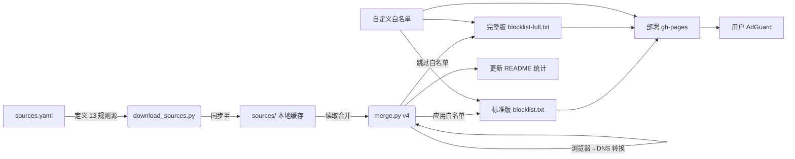

# 🛡️ AdGuard 规则合并器

<p align="center">
  <strong>自动合并、去重、白名单过滤 AdGuard Home DNS 拦截规则</strong><br>
  <code>13 规则源 → blocklist.txt(标准版) + blocklist-full.txt(完整版) + whitelist.txt → GitHub Pages</code>
</p>

<p align="center">
  
  
  
</p>

---

[中文] | [English](#-english)

## ✨ 核心特性

- 🔄 **自动更新** — 每 5 小时拉取 13 个精选源，自动合并去重
- 🔒 **DNS 纯兼容** — 自动过滤浏览器专用规则（如 `##`），只保留 DNS 层生效规则
- 🎯 **跨源去重** — 全局域名去重，减少冗余
- 🛡️ **白名单保护** — 标准版自动应用白名单；完整版需手动订阅（防误杀）
- 💾 **本地缓存** — 所有源同步至 `sources/`，离线合并更稳定
- 🌐 **智能转换** — 自动从 `##` 规则提取域名转为 `||` 格式
- 📊 **透明统计** — 每次合并自动更新规则数统计

---

## 📥 订阅地址

| 用途 | 订阅链接 | 说明 |
|------|----------|------|
| 🚫 **标准版** | `https://lzylipu.github.io/adguard-rules-merger/blocklist.txt` | **推荐日常使用**，已应用白名单 |
| 🚫 **完整版** | `https://lzylipu.github.io/adguard-rules-merger/blocklist-full.txt` | 13 源全量，**不含白名单**（需单独订阅） |
| ✅ **白名单** | `https://lzylipu.github.io/adguard-rules-merger/whitelist.txt` | 防误杀规则，**完整版用户必订** |
| 📊 **统计** | `https://lzylipu.github.io/adguard-rules-merger/stats.json` | JSON 格式规则详情 |

---

## 🧩 规则来源统计

> ⚠️ **关于 GOODBYEADS**：原 `868864/DNS_RULE` 已删除，现使用 `8680/GOODBYEADS` (master 分支)

### 🟢 标准版（7 源，推荐日常）

| 规则源 | 说明 | || 规则数 |
|:-------|:-----|:-------:|
| **GOODBYEADS-DNS** | DNS 层去广告，中文优先 🇨🇳 | 116,505 |
| **Hagezi-Light** | 广告 + 追踪精简版 | 43,372 |
| **Hagezi-DOH** | 绕过加密 DNS (DoH) 的域名 | 3,437 |
| **Hagezi-Fake** | 仿冒/钓鱼网站拦截 | 16,851 |
| **Anti-Ad** | 中文 DNS 首选，easylist 格式 🇨🇳 | 97,540 |
| **EasyPrivacy** | 全球隐私追踪拦截 | 46,897 |
| **Yoyo** | 经典广告服务器列表 | 3,507 |
| | **合计**（含白名单去重） | **161,520** |

> 💡 **标准版逻辑**：7 源去重 + 应用 1,694 条白名单 → **16.1 万条纯净规则**

### 🔵 完整版（+6 源，全量覆盖）

| 规则源 | 说明 | || 规则数 |
|:-------|:-----|:-------:|
| *(包含上述 7 个标准源)* | | | |
| **EasyListChina** | 中文广告专项 + 浏览器→DNS 自动转换 🇨🇳 | 61,355 |
| **Hagezi-Pro** | 广告/追踪/挖矿/诈骗/仿冒全覆盖 | 230,539 |
| **217heidai-DNS** | 国产 DNS 规则大合集 (纯域名) | 71,802 |
| **OISD-Small** 🆕 | 社区力荐，*Block. Don't break.* | 61,267 |
| **1Hosts-Lite** 🆕 | badmojr 维护，专注广告追踪 | 3,475 |
| **DandelionSprout** 🆕 | 反恶意软件 + 诈骗，AG 原生支持 | 11,451 |
| | **合计**（跨源去重，**未**含白名单） | **346,981** |

> 💡 **完整版逻辑**：13 源去重 → **34.7 万条强拦截规则** (需订阅白名单防误杀)

### ⚪ 白名单（2 源 + 40 条自定义）

| 来源 | 说明 | 域名数 |
|:-----|:-----|:------:|
| **GOODBYEADS-Allow** | GOODBYEADS 白名单 | 732 |
| **Hagezi-Referral** | HaGeZi 推荐来源保护 | 923 |
| **自定义规则** | 国内 CDN、支付、社交、视频、电商等保护 | 40 |
| | **合计**（去重后） | **1,694** |

---

## 🚀 快速接入

### 方案 A：标准版（新手/日常推荐）

1. 打开 **AdGuard Home** → **过滤器** → **DNS 拦截列表**
2. 添加: `https://lzylipu.github.io/adguard-rules-merger/blocklist.txt`
3. 添加白名单: `https://lzylipu.github.io/adguard-rules-merger/whitelist.txt`
4. ✅ 完成。规则每 5 小时自动更新，无需手动干预。

### 方案 B：完整版（极致拦截）

1. 打开 **AdGuard Home** → **过滤器** → **DNS 拦截列表**
2. 添加完整版: `https://lzylipu.github.io/adguard-rules-merger/blocklist-full.txt`
3. **必做**: 添加白名单: `https://lzylipu.github.io/adguard-rules-merger/whitelist.txt`
4. ✅ 完成。拦截更彻底，但**必须订阅白名单**以防国内服务误杀。

---

## ⚙️ 工作原理



### 自动化流程

1. **触发**: 每 5 小时 (Cron) 或 推送 `sources.yaml`/`merge.py`
2. **拉取**: 下载 15 个源文件到 `sources/` 目录
3. **合并**: 解析规则，过滤非 DNS 格式，全局去重
4. **转换**: 将 `##css` 类浏览器规则转为 `||domain^`
5. **分流**: 生成标准版（含白名单）与完整版（不含白名单）
6. **部署**: 提交更新到 `main`，自动部署 `gh-pages`

---

## 🔧 自定义维护

编辑 `sources.yaml` 添加新源：

```yaml
blocklist:
  - name: 我的自定义源
    url: https://example.com/ads.txt
    desc: 个人维护规则 🎯

whitelist:
  custom:
    - "||my-essential-site.com^"
```

推送后，GitHub Actions 会自动触发更新。

---

## 📊 常见疑问

**Q: 为什么完整版必须订阅白名单？**
A: 完整版包含海量规则（如 Hagezi-Pro, 217heidai），极易误杀国内常用 CDN 和 API 服务。白名单是安全网，**强烈建议必订**。

**Q: 浏览器→DNS 转换是什么？**
A: AdGuard 浏览器规则如 `example.com##.ad-banner` 在 DNS 层无法生效。脚本自动提取其中的域名 `||example.com^`，转为 DNS 规则，最大化拦截能力。

**Q: 规则多久更新？**
A: 每 5 小时自动运行一次。手动修改 `sources.yaml` 也可立即触发。

---

## 🇬🇧 English Summary

**Core Features**: Auto-merge 13 sources, DNS-compatible filtering, cross-source deduplication, browser-rule-to-DNS conversion, local caching for stability.

**Subscribe**:
- **Standard** (Recommended): `blocklist.txt` (includes whitelist)
- **Full** (Aggressive): `blocklist-full.txt` (requires separate `whitelist.txt`)
- **Whitelist**: `whitelist.txt` (prevents false positives)

**Sources**: Standard (7) + Full Extras (6) + Whitelist (2+40).

**Note on GOODBYEADS**: Migrated from deleted `868864/DNS_RULE` to `8680/GOODBYEADS`.

---

*Last updated: 2026-06-28 | Version v4 (local mode)*
